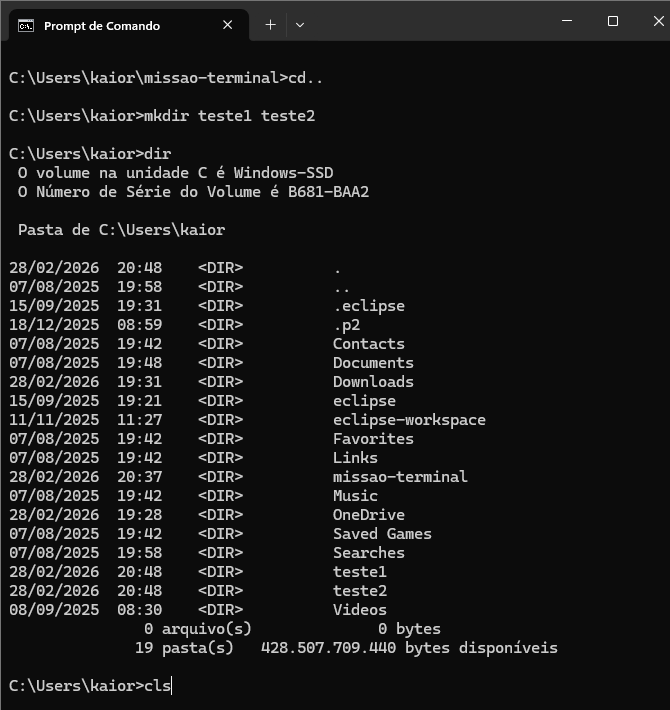

# una-algprog-terminal
# ⚡ Meus Comandos Favoritos
Aqui estão os comandos que mais utilizei na aula de Terminal:

- `cd`: Para navegar entre pastas.
- `dir`: Para listar arquivos.
- `cd ..` : sai da pasta atual e volta para anterior.
- `mkdir` : criação de um novo diretório.
- `cls` : limpa os códigos já executados (limpa a tela).
## 📸 Evidência de Execução

